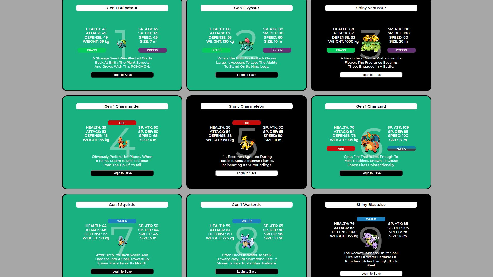

# MyDex-Pokedex-Clone (In Development Now)

[](https://opensource.org/licenses/MIT)

A clone of the Pokedex where you can create an account, save your favorite pokemon or teams, and then show them off to friends you added via your PokeProfile!

This app was made using XAMPP Apache Server with PHP & SASS for Templating and Google Firebase BaaS(Backend As A Service) with Firestore.



## Table of Contents  
* [Usage](#usage)
* [Installation](#installation)
* [Licensing](#licensing)
* [Questions](#questions)

## Usage
You can view the deployed application at https://blues-login.herokuapp.com/

## Installation
```
download or install Xampp (You only need apache server, SQL, PHP, & FileZilla Server)
find the htdocs folder located in the newly created xampp folder
git clone git@github.com:strawhat19/MyDex-Pokedex-Clone.git into htdocs folder
start Xampp Control Panel
start Xampp Apache Server
go to localhost/MyDex-Pokedex-Clone/ or localhost/MyDex-Pokedex-Clone/index.php in your browser
```

## Licensing
[](https://opensource.org/licenses/MIT)
#### 
      MIT License

      Copyright (C) 2012-2020 by various contributors (see AUTHORS)

      Permission is hereby granted, free of charge, to any person obtaining a copy
      of this software and associated documentation files (the "Software"), to deal
      in the Software without restriction, including without limitation the rights
      to use, copy, modify, merge, publish, distribute, sublicense, and/or sell
      copies of the Software, and to permit persons to whom the Software is
      furnished to do so, subject to the following conditions:

      The above copyright notice and this permission notice shall be included in
      all copies or substantial portions of the Software.

      THE SOFTWARE IS PROVIDED "AS IS", WITHOUT WARRANTY OF ANY KIND, EXPRESS OR
      IMPLIED, INCLUDING BUT NOT LIMITED TO THE WARRANTIES OF MERCHANTABILITY,
      FITNESS FOR A PARTICULAR PURPOSE AND NONINFRINGEMENT. IN NO EVENT SHALL THE
      AUTHORS OR COPYRIGHT HOLDERS BE LIABLE FOR ANY CLAIM, DAMAGES OR OTHER
      LIABILITY, WHETHER IN AN ACTION OF CONTRACT, TORT OR OTHERWISE, ARISING FROM,
      OUT OF OR IN CONNECTION WITH THE SOFTWARE OR THE USE OR OTHER DEALINGS IN
      THE SOFTWARE.
      
      Copyright 1998 by the Massachusetts Institute of Technology.

      Permission to use, copy, modify, and distribute this software and its
      documentation for any purpose and without fee is hereby granted, provided that
      the above copyright notice appear in all copies and that both that copyright
      notice and this permission notice appear in supporting documentation, and that
      the name of M.I.T. not be used in advertising or publicity pertaining to
      distribution of the software without specific, written prior permission.
      M.I.T. makes no representations about the suitability of this software for any
      purpose.  It is provided "as is" without express or implied warranty.
#### https://opensource.org/licenses/MIT

## Questions
#### GitHub Profile: [*strawhat19*](https://github.com/strawhat19)
#### Contact me or ask me questions at [rakib987@gmail.com](mailto:rakib987@gmail.com).